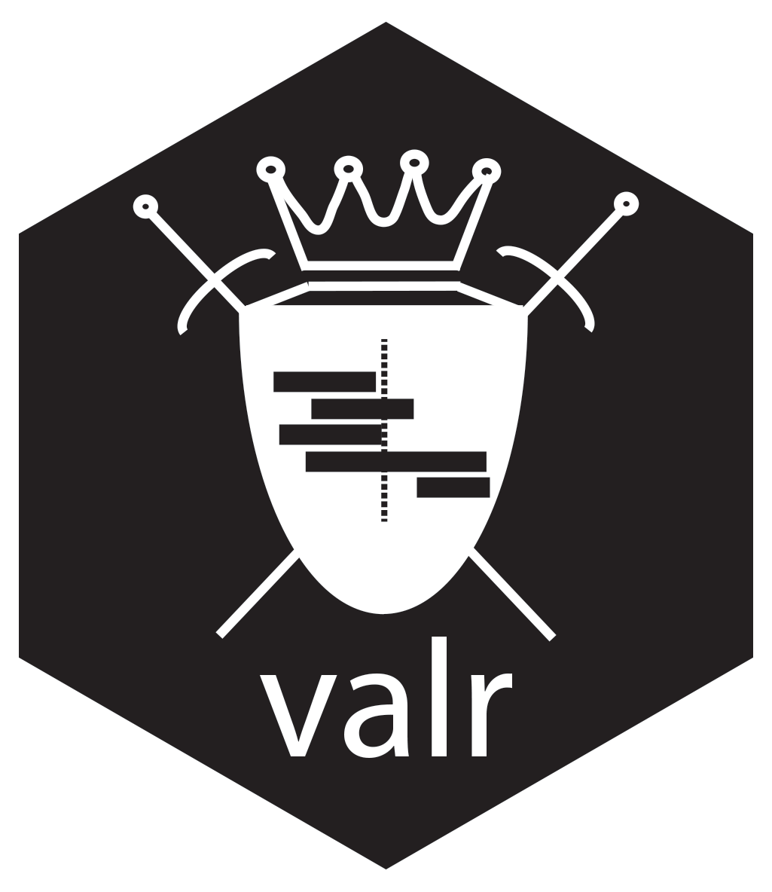

# Introduction {#intro}

```{r fig.align='center', echo=FALSE, include=identical(knitr:::pandoc_to(), 'html'), out.width='30%'}
 
```

`valr` provides tools to read and manipulate genome intervals and signals, similar to the standalone [`BEDtools`][1] suite. `valr` enables BEDtools-like analysis in the R/RStudio environment, and uses modern R tools for a terse, expressive syntax. We created `valr` from a desire to teach students to analyze genomic data using powerful concepts of interval arithmetic, but without the cumbersome back-and-forth between command-line analysis and exploratory analysis tools. Many `valr` functions leverage the speed and grouping capability provided by [`dplyr`][3], and compute-intensive algorithms are implemented in [`Rcpp`][5]/C++ to maximize speed.

We provide several introductions to `valr`:

  - This comprehensive vignette that covers the core methods.
  - A `shiny` application that demonstrates interactive analysis of genome-scale data sets.

## Installation {#install}

`valr` can be installed from github, and will be eventually deposited in CRAN.

```r
devtools::install_github('jayhesselberth/valr')
```

## Comparison to other tools {#tool-compare}

**Why another tool set for interval manipulations?** We already have [BEDtools][1], [bedops][8], [pybedtools][7], [GenomeRanges][9], [bedr][11] and [IRanges][12]. 

We were motivated to develop a toolset that:

  - Combines analysis and visualization in RStudio.
  - Can be used to generate *reproducible* reports with RMarkdown.
  - Is highly extensible. New tools are quickly implemented on the R side.
  - Leverages the "modern R" syntax, using `dplyr` and the pipe operator from `magrittr` (`%>%`).
  - Maximizes speed by implementing compute-intensive algorithms in `Rcpp`.
  - Facilitates interactive visulaizations with [`shiny`][10].

`valr` currently supports data in BED, bedGraph and VCF formats. We anticipate also supporting BAM and VCF formats in a robust way as needs arise.

Certain algorithms in `valr` were implemented in `Rcpp` (including [intersect, merge, subtract, closest][14]) to enable fluid interactive analysis. See the [benchmarks](#benchmarks) section for details.

## Acknowledgments

`valr` began as a project in a [genomics workshop class](http://molb7621.github.io) but has become a mature software package. Key contributions have been made by Kent Riemondy, Ryan Sheridan and Ryan Mackie.

## Contribute {#contribute}

`valr` is actively maintained on [github](http://github.com/jayhesselberth/valr) and we welcome questions about the package and ideas for new tools.
